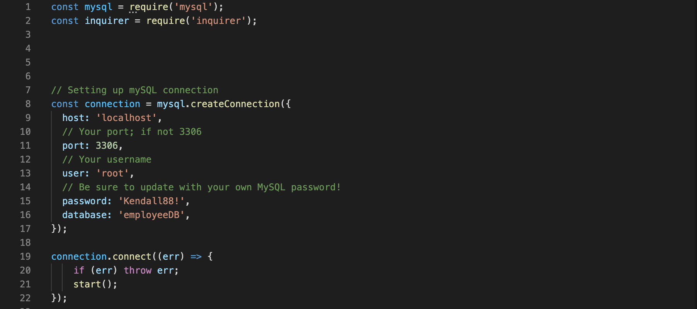

# Employee Tracker

Application for managing a company's employee's using node, inquirer, and mySQL. This application is a solution for managing a company's employees using node, inquirer, and MySQL.

## Challenge

```
As a business owner
I want to be able to view and manage the departments, roles, and employees in my company
So that I can organize and plan my business
```

## MySQL Set-Up

To start, we created a database schema within mySQL containing three tables:

* **department**:

  * **id** - INT PRIMARY KEY
  * **name** - VARCHAR(30) to hold department name

* **role**:

  * **id** - INT PRIMARY KEY
  * **title** -  VARCHAR(30) to hold role title
  * **salary** -  DECIMAL to hold role salary
  * **department_id** -  INT to hold reference to department role belongs to

* **employee**:

  * **id** - INT PRIMARY KEY
  * **first_name** - VARCHAR(30) to hold employee first name
  * **last_name** - VARCHAR(30) to hold employee last name
  * **role_id** - INT to hold reference to role employee has
  * **manager_id** - INT to hold reference to another employee that manages the employee being Created. This field may be null if the employee has no manager

## Development Process

To start, we needed to set up the mySQL connection:



With that set up, we then needed to create the initial prompts for the user the be given the options of what type of action they would like to take: View all employees, view all employees by department, view all employees by manager, add an employee, remove and employee, update and employee's role, and update and employee's manager. To do so, we utilize the inquirer package:


As you can see, each prompt calls a specific funtion to handle what it is the user wants to do. Below, you can see the function for viewing all employees:


Here, we store the mySQL query inside the const query and then utilize connection.query to run this query and obtain the result. The actual table is displayed using console.table of the response (res). You can also see that inside the query itself, table joins are used to combine aspects of the roles and departments tables so that more information is provided that each of the individual tables dont provide alone. Additionally, in order to get the manager's full name, we utilize CONCAT. The view employees by department and manager function were structured in a similar way:


The only difference here is that we are changing the WHERE portion of the query statement.

The add employee function gets a little more complicated as it requires multiple queries in order to successfully add an employee based on the inputs of the user. For example, when specifying which role title the new employee has, we need to take this role title and capture the id associated with it so that that value can be entered as the role_id in the employee table. Same goes for the manager. Below shoes an example of how this is done given the role title selected by the inquirer prompt:


The query seen above displays all roles and res.map is utilized to map through those roles and capture the id and title itself, stored into the const roles. Then, this array of role titles is given as the options in the inquirer prompt. Whichever role is selected, the value stored for that role title is the actual role id itself.

This structuring and layout of code was utilized for not only the add employee function, but also for the update role, update manager, and remove employee functions.

## Credits

* MySQL - [MySQL](https://www.npmjs.com/package/mysql) NPM package to connect to MySQL database and perform queries.

* Inquirer - [InquirerJs](https://www.npmjs.com/package/inquirer/v/0.2.3) NPM package to interact with the user via the command-line.

* Console.table - [console.table](https://www.npmjs.com/package/console.table) to print MySQL rows to the console.

## Links

GitHub Repository - [Employee Tracker Generator Repository](https://github.com/ktrudickm/Employee_Tracker "Employee Tracker Repository")
